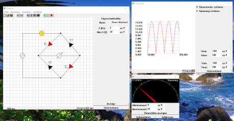
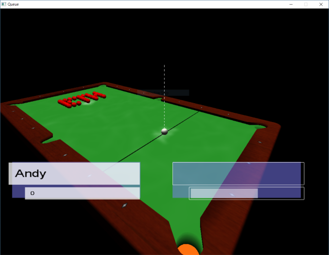
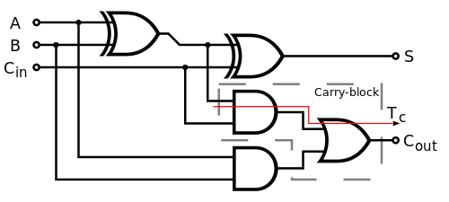
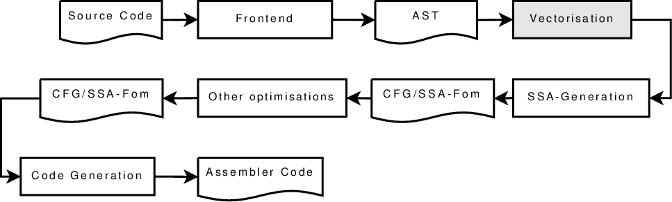

# Old Project

I started programming back when I was in grammar school. Starting in 1999 with
I soon dived into various progamming languages and tried out what I could get
into my hands.
It started with Java Script, where I happened to pick up a book from my fathers
library by accident. Soon I moved to Visual Basic 6 and then Java.
Wanting to better understand how everything works under the hood, I had to add
x86 assembler to that list, before I started to settle for a bit with C++.

My first 'real' programming project then was a joint thesis project with two
class mates.

## [Elektron (2002)](Elektron/Elektron.md)

{:.align-left}

Having not the slightest clue how difficult it would turn out, we convinced our
teacher that we would develop a cross-platform (Windows 9x, MacOS 9)
simulation program for simple
[analog circuits](https://en.wikipedia.org/wiki/Electronic_circuit#Analog_circuits).

Elektron allows the user to draw and configure an analog circuit by dropping
components onto a drawing canvas, move them around, connect them to other
components and configure their properties.
The designed circuits can be simulated and the changing properties observed by
reading virtual power meters or the brightness of LEDs and lights.

Used technologies: *CodeWarrior, C++, Win32, Carbon*

## Queue (2005)

{:.align-left}

As part of the software engineering class, we designed and implemented a game.
In a small team of four, we built a 3D billiard game.
It features a realistic physics engine and supports different billiard variants.
The popular [8-Ball](https://en.wikipedia.org/wiki/Eight-ball) two-player mode
and a time based single player mode, called ETH-mode.
The graphics engine and the HUD use OpenGL and both are completely in 3D.

Used technologies: *EiffelStudio, SVN, Eiffel, OpenGL*
Used concepts: *Business Object Notation (BON)*

## Digital Circuit Simulation (2005)

{:.align-left}

Digital circuit design was fun. Towards the end of the semester I was wondering
if it would be possible to build a simulator for simple circuit designs using
C# delegates. The answer is, yes. Delegates allow to let any change to the input
be automatically trickled to the output.

Used technologies: *Visual Studio, C#*

## From Eiffel to C# (2005)

Believes are strong motivators to do things. And back in the summer of 2005 I
believed that I had to tell my university collegues that C# was better than
Eiffel, the language we were using in lectures. So, I organised a small workshop
and prepared some slides and written documenation. In order to get some practice,
my 'students' had to implement a small UI application within a small framework.

## Gravity Bound (2007)

## Auto-vectorizer (2007)

During my time as computer science student I attended a basic and an advanced
compiler design class. While the former was focused on language parsing,
intermediate representatin generation and code generation, the advanced class
focused on code transformation and optimization using the Static Single
Assignment (SSA) form. As part of this class, together with a friend, I
implemented an automatic loop vectorizer, which turned SISD into SIMD code.

{:.align-left}

Due to time constraints, we did not manage to more than the basics, these
however very successfully. We managed to properly unroll and vectorize simple
loops.

Used technologies: *Java, GNU Assembler (GAS), SVN*
Used concepts: *Single Instruction Multiple Data (SIMD), Static Single Assignment (SSA)*

## Dark Physics (2007)

## Raytracer (2007)

## Real-time Wavelet Turbulence Simulation (2008)
